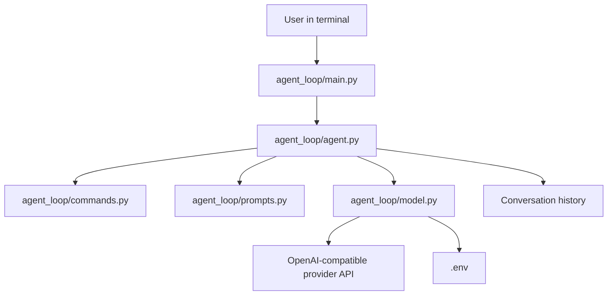
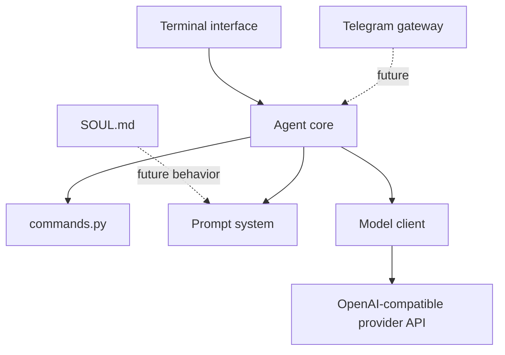

# Sēcan Architecture

## Current architecture

## Current responsibilities

- `main.py` starts the program.
- `agent.py` manages the conversation loop and message history.
- `commands.py` recognizes terminal commands and returns their meaning to `agent.py`.
- `model.py` sends messages to the configured OpenAI-compatible provider and returns the response text.
- `prompts.py` stores the system prompt.
- `.env` stores the provider endpoint, model name, and private API key.

## Planned architecture

The agent core should remain separate from interfaces such as the terminal or Telegram. This allows multiple interfaces to reuse the same conversation and model logic.
